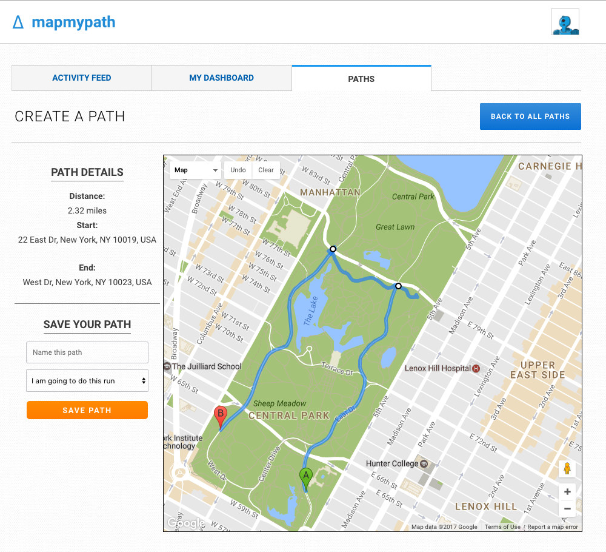
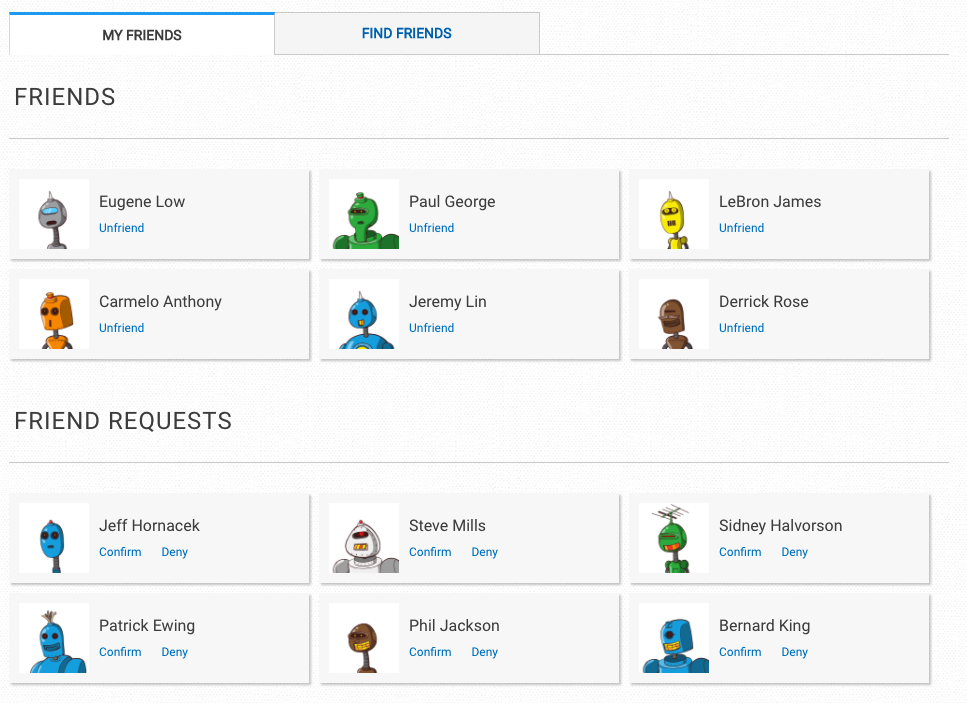
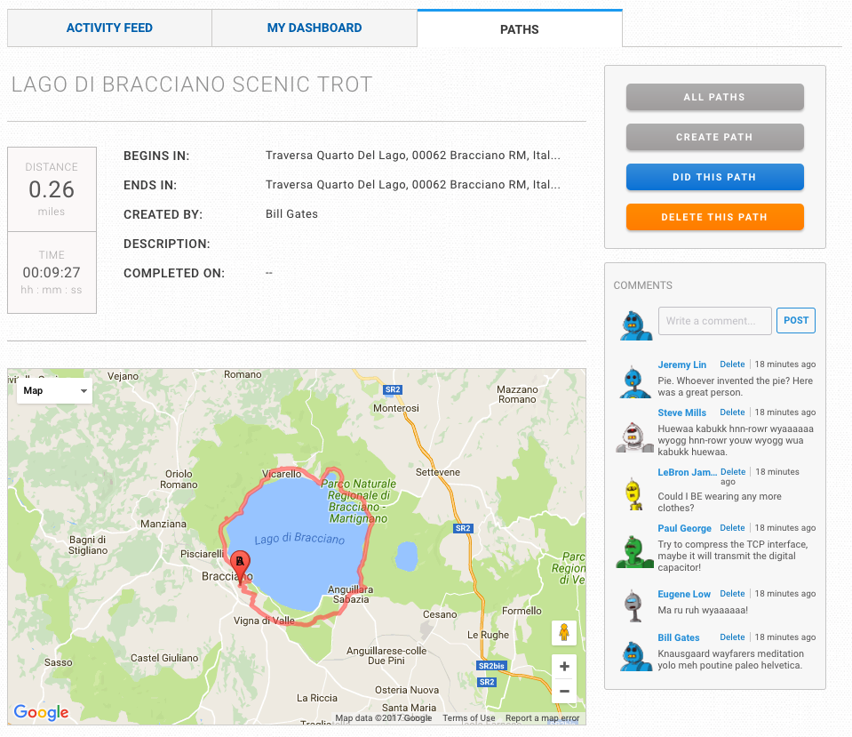

# MapMyPath
-----------

[MapMyPath](https://mapmypath.herokuapp.com/)

---

MapMyPath is full-stack web application clone of MapMyRun, created using Ruby on Rails on the backend with a PostgreSQL database and React.js with a Redux architectural framework on the frontend. Users are able to map out the paths they have walked/run and keep tracking of the total distance and time of each route.

## Features and implementation

---
### Path creation

The core feature of this application is the utilization of Google Maps API to mark and render the routes that the user will be creating.

---


---
The map provides real time updates on the total distance of the path along with the starting and ending locations. There were quite a bit of tweaking of the map API to make the user experience as smooth as possible. First, the cursor was changed to a target to make it more intuitive. Autozoom was also turned off to make sure the user is able to stay in focus on what they want to see. The markers are set to show the start and end points, keeping track of which marker is first to render the correct information.

---
```javascript
addMarker(position) {
  const marker = new google.maps.Marker({
    position,
    map: this.map,
    label: 'A'
  });

  this.pathMarkers.push(marker);

  const markers = this.pathMarkers;

  if (markers.length > 1) {
    markers[0].setMap(null);
    marker.setMap(null);
    this.getDirections(markers);
  }
}
```
---
Each click creates a new marker on the map that is stored in the component's state. Once there are two or more markers, directions are rendered onto the map. When creating the undo button, I was unable to clear the directions off the map. Originally, I had created a new instance of the map, but there was a flash that was seemed very out of place.  The solution was instead to create a new instance of directions and remove the old directions all together.

---
```javascript
clearDirections() {
  this.directionsRenderer.setMap(null);
  this.directionsRenderer = new google.maps.DirectionsRenderer(
    {
      map: this.map,
      preserveViewport: true,
    }
  );
  this.updateState({
    distance: 0,
    polyline: '',
    start_address: 'N/A',
    end_address: 'N/A'
  });
}
```

---
This created a much smoother experience for the user to create their route.


---
### Friending



Users have the abilities search and become friends with others upon acceptance. There is a relationships table that takes care of friend requests and the actual friendships. It holds two user IDs, the status of the relationships and the initiator of the relationship.

---
```ruby
def friends
  User
    .joins('JOIN relationships ON relationships.user_one_id = users.id OR relationships.user_two_id = users.id')
    .where("relationships.status = '1'")
    .where('relationships.user_one_id = :id OR relationships.user_two_id = :id', id: self.id)
    .where('users.id != :id', id: self.id)
end

def pending_friends
  User
    .joins('JOIN relationships ON relationships.user_one_id = users.id OR relationships.user_two_id = users.id')
    .where("relationships.status = '0'")
    .where('relationships.user_one_id = :id OR relationships.user_two_id = :id', id: self.id)
    .where('users.id != :id AND relationships.action_user_id != :id', id: self.id)
end
```

---

### Path page


---
Each path has their own details page along with a comment section. The owner of the path has the ability to set the completion of the path, delete the path and the ability to delete comments off the path page. A visit to a friend's page will only allow the ability to comment and the deletion of your own comment.

---

## Future Directions for the Project

I plan on continuing to improve upon the already implemented features and also adding the below features.

#### Commenting on the activity feed page

I plan on working to allow users to comment directly on their friends' activities instead of having to go into the individual path page.

#### User profile

In order for more social interaction, I want users to be able to share the stats they have on their runs with their friends.

#### Real time tracking

To improve user experience, I want to make use of Google GPS tracking to map out the paths that the uses have walked/ran instead of having the manual need to map it out on a map.
